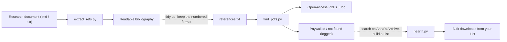

# hearth


## Overview

hearth is a Python script to help mass download an Anna's Archive List. 

It has been made with the help of Gemini: I had never used Python before, and the AI handled the more complex parts of the code. The idea for the script and how it works is mine, all the main logic is written by me and I have revised and tested all AI generated code. All of `README.md` has been written manually by me (except for the terminal commands and error handling).

**Key features**:
- This is a terminal tool that accepts command line parameters to function (more about usage below).
- hearth supports Anna's Archive List links in the form of `https://annas-archive.XX/list/<list_id>` as well as importing a list of Anna's Archive links from a `.txt` file.
- The tool will spin up a virtual browser that physically visits the link page, waits for the download cooldown and renames the downloaded file, before going ahead to the next List element, logging successes and failures in specific files.
- These files allow you to not only stop the script mid-way, closing the terminal windows completely, and then resuming from the last link it successfully downloaded (by using the same exact command), but it also allows to retry for failed links once the tool has finished processing the whole queue.
- You can use the `completed.txt` file that the script will create in your download directory as an index of all the files you downloaded as well as their md5 code.
- The download destination folder is chosen via command line parameters. Here will be stored said files.
- You can set how to rename the downloaded files, based on how much information you want to be in the filename, via command line parameters.

> **Two companion tools live in this repository too**: `find_pdfs.py`
> (download the *open-access* PDF of each reference in `references.txt`) and
> `extract_refs.py` (pull every article / book / report / web source out of any
> `.md`/`.txt` document). See the
> [workflow section](#companion-tools-extract_refspy-and-find_pdfspy) at the
> bottom of this file for how the three scripts fit together.


## Downloading the script and folder set-up

1. Create a new folder named `hearth` or `AAdownloaderScript` (or the name you prefer) on your computer.
2. Download `hearth.py` and `requirements.txt` from this repository and put the files in the folder you just created (or download the whole repository as a `.zip` and extract it, before copying those two files from the extracted folder into your newly created folder).
3. (Optional) inside of the `hearth` folder, make another folder in which your downloaded files will go. Name this second folder `AAdownloads` or anything you deem fit.


## Component installation and script launch

### **Python installation and installation of necessary tools**
This is a Python script. You will need to have Python (and Playwright) installed for it to run.

#### <ins>On Windows</ins>:
**Python installation**:

You can install Python by going to https://www.python.org/downloads/ and downloading the installer for the latest version.  
Be sure to check the box that says "Add python.exe to PATH" before clicking on "Install Now" (if you skip this, the script won't work.).

Alternatively, you can install it via command prompt using Winget.  
Open CMD and paste this command:
```
winget install Python.Python.3.12 --source winget
```
substituting `3.12` with the latest version.

Alternatively, open CMD, type `python`, and press Enter. This will automatically open the Microsoft Store to the most up-to-date version of Python available for your system.

**Installation of necessary tools**:

The script needs a tool called "Playwright" to control the web browser.

We can install it, as well as any other dependency, via `requirements.txt`.

To do this, open CMD directly inside of the folder that contains `hearth.py` and `requirements.txt`, or `cd` into it (the command should be `cd <pathToHearthFolder>`) and paste this command:
```
python -m pip install -r requirements.txt
```
Once that finishes downloading and installing, paste this one:
```
python -m playwright install chromium
```
With this, we have everything necessary.

#### <ins>On Linux</ins>:
**Python installation**:

Most Linux distributions already have Python installed. You just need to ensure you have `pip` (the package installer) to download the necessary tools.  
Open your terminal and run the following command (this example uses `apt` for Debian/Ubuntu-based systems, but you should easily be able to find the specific command for your distro):
```
sudo apt update && sudo apt install python3 python3-pip
```

**Installation of necessary tools**:

The script needs a tool called "Playwright" to control the web browser, plus a few system dependencies to run it. We can install them using the `requirements.txt` file.  
Open your terminal directly inside of the folder that contains `hearth.py` and `requirements.txt`, or `cd` into it (the command should be `cd <pathToHearthFolder>`) and run these commands one by one:
```
pip3 install -r requirements.txt
playwright install chromium
playwright install-deps
```
*Note - IN CASE OF ERROR: if `pip3 install -r requirements.txt` raises an `externally-managed-environment` error, running `pip3 install -r requirements.txt --break-system-packages` instead should fix it.*  
*Note: the `install-deps` command might ask for your system password to install missing browser libraries.*

Note: Calling `playwright` directly can sometimes fail if `~/.local/bin` isn't in the user's shell `$PATH`. Using `python3 -m` for all commands should circumvent this for most Linux environments:

```
python3 -m pip install -r requirements.txt
python3 -m playwright install chromium
python3 -m playwright install-deps
```

With this, we have everything necessary.


### Script launch

To launch hearth, simply open your terminal directly inside of the folder that contains `hearth.py` (you can delete `requirements.txt` at this point if you so desire) or `cd` into it (the command should be `cd <pathToHearthFolder>`) and paste the following command:
```
python hearth.py
```
*ATTENTION: as older versions of Linux used to ship with both Python 2 and Python 3, the launch command on Linux is almost always `python3`, not just `python`. Linux users should type `python3 hearth.py` instead. Assume this for the next steps.*

## Usage

Simply launching the script with `python hearth.py` will do nothing, as the script has no parameters (such as your List or your `.txt` file, the operating mode, the chosen download directory and the file naming options)

To correctly use hearth, follow this scheme:
```
python hearth.py <OPERATING_MODE/LIST_LINK> <DOWNLOAD_FOLDER_DIRECTORY> [FILENAME_FORMAT]
```
These are the options you have:

### <OPERATING_MODE/LIST_LINK>

Here you can put one of the following parameters:

- The link to your Anna's Archive List. An example is `https://annas-archive.XX/list/<list_id>`.
- `text`. This tells the script to not expect a link to a List and instead read the AA links directly from a `.txt` file, named `aa_links.txt`, that you will put in the `AAdownloads` folder (or what you've called it).
- `retry`. To be used after hearth has already completed a queue of links, be it from a List link or `aa_links.txt`, and has failed to download some of them. This tells the script to retry all of the downloads that failed from the previous queue. ATTENTION: This requires the downloads folder to be the same as the previous operation (the one of which you want to retry the failed links).

Note: when using `text` mode, the `aa_links.txt` file should be formatted in the following way:
```
https://annas-archive.XX/md5/<md5_code_0>

https://annas-archive.XX/md5/<md5_code_1>

https://annas-archive.XX/md5/<md5_code_2>

...
```

### <DOWNLOAD_FOLDER_DIRECTORY>

Here you have to put the directory of the folder `AAdownloads` (or the name you chose for it).

If you hadn't created it until now, it will be created once you launch the script.

**Windows example**:
```
"C:\hearth\AAdownloads"
```

**Linux example**:
```
~/hearth/AAdownloads
```
or (as in some Linux shells (like Bash or Zsh), tilde expansion does not work inside double quotes)
```
"/home/<your username>/hearth/AAdownloads"
```

### [FILENAME_FORMAT]

When you download a file from Anna's Archive, the site gives you a suggested filename with a lot of information such as Title, Author(s), Year of publication, Publisher, ISBN, md5 code, and more.
This parameter tells the script which ones of these you want to be present in the name of your files.

You can leave it blank (which is the default and corresponds to `full`) or put one of the following parameters:
- `full`. This tells the script to save in the file's name all the info that Anna's Archive suggests, including the md5 code and "Anna's Archive" at the end.
- `info`. This tells the script to save in the file's name all the info that Anna's Archive suggests, however excluding the md5 code and "Anna's Archive" at the end.
- `author`. This tells the script to save only the Title and the Author, in which case a hyphen will be put between the two.
- `title`. This tells the script to save only the Title of the media you're downloading.

## IMPORTANT STEP: CAPTCHAS

As the browser controlled by Playwright is automated, it cannot solve Captchas.

At the launch of the script, when the main List link is loaded or when a mirror "slow download" link is loaded for the first time, the browser might ask you to solve a Captcha. The script will wait for you to do so.

Normally, solving the Captcha that appears at the load of the main List page as well as the one that appears at the first load of a mirror "slow download" link <ins>is enough for the rest of the session</ins>.

## What this script supports

This script officially supports and has been tested with:

- Files present on normal "slow download" mirrors, such as these:
  

- Files present on Libgen mirrors, such as these:
  

## License

This project is under the MIT license. Check out `LICENSE` for more details.

## Issues and suggestions

This project is still new, I know little about Python and I have a lot to learn.

If you have any issues or bugs to report, please feel free to do so. Same thing goes for suggestions or improvements.

---

## Companion tools: `extract_refs.py` and `find_pdfs.py`

This repository now contains **three** scripts that each do one job. Used
together they cover the whole path from *a research document* to *files on
your disk*:

| Script | What it does | Input | Output | Dependencies |
| --- | --- | --- | --- | --- |
| `extract_refs.py` | Extracts every article, book, report and web source mentioned in a document | any `.md` / `.txt` file | a readable bibliography (Markdown or text) with incomplete entries flagged | none |
| `find_pdfs.py` | Downloads the *open-access* PDF for each reference | a numbered `references.txt` | PDFs plus a log (found / paywalled / missing) | none (Playwright optional) |
| `hearth.py` | Bulk-downloads the items of an Anna's Archive **List** you curated | an AA List URL or `aa_links.txt` | the downloaded files | Playwright |



### Why are `hearth.py` and `find_pdfs.py` two separate scripts?

They download from **different worlds**, so keeping them separate is the
point:

* `hearth.py` is a **site-specific bulk downloader**. It needs the concrete
  Anna's Archive `/md5/...` links of a List (or an `aa_links.txt`) and then
  mass-downloads them. It **cannot search by title** and does not know what
  "open access" means.
* `find_pdfs.py` is a **legal, open-access finder**. Given a scholarly
  reference it searches [OpenAlex](https://openalex.org) by
  *title / author / year* and grabs the newest **openly licensed** PDF. It
  never touches Anna's Archive and needs no links up-front.

So the division of labour is: use `find_pdfs.py` for everything you can get
for free and legally; for the books and paywalled titles it could not find,
curate an Anna's Archive List and let `hearth.py` do the heavy downloading.

### Where `extract_refs.py` fits

`references.txt` (the numbered list that `find_pdfs.py` reads) is the shared
interface between the two companions. `extract_refs.py` is the "front door":
instead of typing a reference list by hand, point it at any `.md` or `.txt`
research document and it pulls out all the published sources for you. If you
keep the same numbered format, that list can be handed straight to
`find_pdfs.py`; whatever `find_pdfs.py` cannot obtain in open access is
exactly what you would go and look for on Anna's Archive for `hearth.py`.

---

## Companion tool: `extract_refs.py` (reference extractor)

`extract_refs.py` extracts **articles, scholarly references and other
published references** (books, chapters, reports, web pages, preprints,
DOIs, arXiv/PubMed IDs) from a plain-text (`.txt`) or Markdown (`.md`) file.
It understands formal reference lists (APA/MLA/Vancouver style, numbered or
not), inline citations like `(Smith & Jones, 2020)`, narrative ones like
`Smith et al. (2020)`, hyperlinks and bare URLs. Detected sources are
de-duplicated, grouped by type, annotated with where they are cited, and
anything incomplete lands in a clearly-marked "needs review" section —
nothing is ever guessed. It needs no third-party packages and makes no
network calls.

### Usage

```
python extract_refs.py paper.md                          # print a Markdown bibliography
python extract_refs.py notes.txt -o bibliography.md      # write a report file
python extract_refs.py paper.md --format txt             # plain-text report
python extract_refs.py paper.md --order alpha            # alphabetise by author
python extract_refs.py paper.md --no-context             # drop the section/line notes
```

### Notes / limitations

- Detection is deliberately conservative: anything ambiguous goes to the
  "needs review" section rather than being reported as a confident reference.
- It reads the file only — it does not resolve or verify anything on the web.
- Reference lists that are not under a `References`/`Bibliography` heading
  are still recognised when the entries look clearly bibliographic.
- A bibliography produced here is not automatically `references.txt`. To feed
  `find_pdfs.py`, export the list in the same numbered format
  (`N.  Author, A. (Year). "Title." Source...`) that `references.txt` uses.

---

## Companion tool: `find_pdfs.py` (open-access PDF finder)

`hearth.py` deals with downloads from a specific site. `find_pdfs.py` is a
separate, strictly **open-access** helper: it reads the references in
`references.txt`, looks each one up on [OpenAlex](https://openalex.org), and
downloads the newest edition that has an **openly licensed PDF** (arXiv, PMC,
repositories, OA journals, etc.). Paywalled works are logged as not-found and
skipped. It needs no extra dependencies beyond the project venv.

### Usage

```
python find_pdfs.py references.txt ./pdfs                 # download OA PDFs
python find_pdfs.py references.txt ./pdfs --email you@example.com   # recommended
python find_pdfs.py --dry-run                             # preview only, no downloads
python find_pdfs.py references.txt ./pdfs --browser       # retry blocked PDFs in Chromium
```

- `--email` enables Unpaywall direct-PDF resolution and the OpenAlex polite
  pool (use your own address). Recommended but not required.
- `--browser` retries, in a real headed Chromium (Playwright), any PDF that
  plain HTTP could not fetch — some publisher CDNs block scripted downloads.
- A timestamped log is written to `<download_dir>/find_pdfs_log.txt` and shown
  in the console: which reference is being considered, the current stage
  (searching / downloading), found or not-found, download progress, and the
  success/failure reason for every item.

### Notes / limitations

- Only *open-access* results are downloaded; many scholarly references are
  paywalled and will be reported as "no open-access PDF available" and skipped.
- Reference matching is deliberately conservative (title overlap + year +
  author surname) so an unrelated OA paper sharing keywords is never grabbed.
- Publisher CDNs (e.g. Wiley, Taylor & Francis, MDPI) commonly return HTTP 403
  to scripts; those files can usually be fetched with `--browser` or saved
  manually from the logged PDF link.


